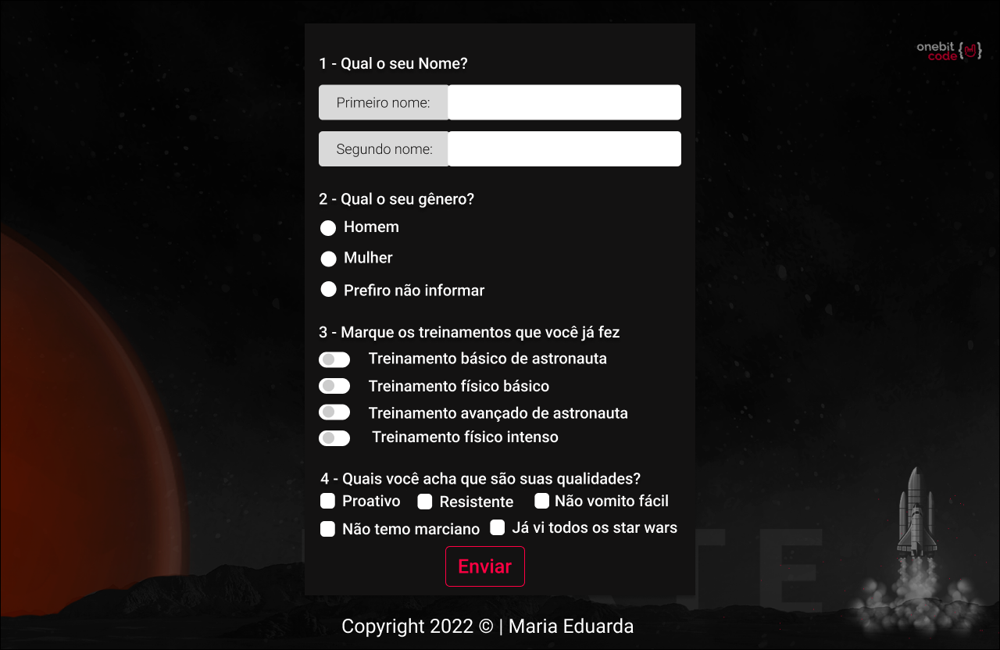
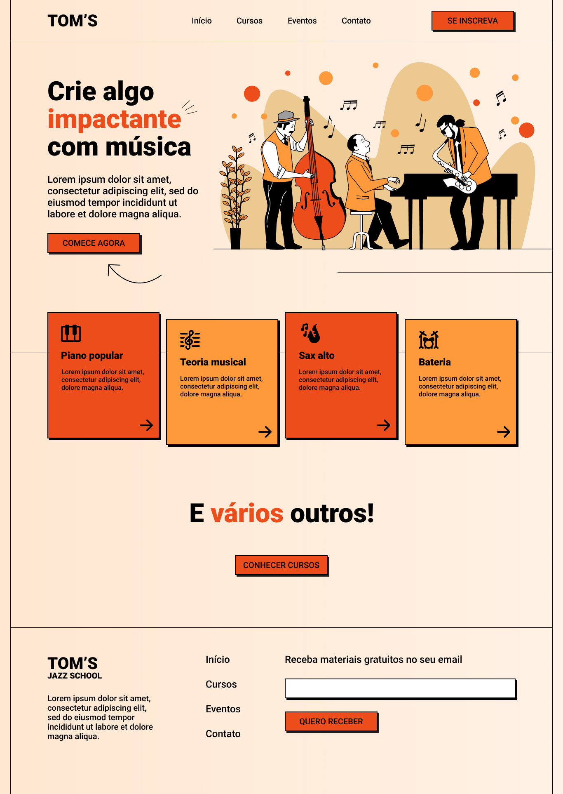

# Landing Pages

Landing page é uma ferramenta que objetiva a transformação de visitantes para clientes. Ela consiste na criação de sites que atraia e chame a atenção do usuário.
Para mim é muito importante o desenvolvimento de páginas simples e chamativas pois é uma ótima maneira de treinar minha habilidades no front-end.

## Linguagens utilizadas
- HTML
- CSS
- Sass
- JavaScript

## Meus projetos usando a ferramenta landing page

- Doctor Strange
[Visualizar projeto](https://maria-efs.github.io/landing-pages/doctor-strange/)

- OneBitX form
[Visualizar projeto](https://maria-efs.github.io/landing-pages/onebitX-form/)

- Tom's Jazz School
[Visualizar projeto](https://maria-efs.github.io/landing-pages/jazz-school/)

##Autor
[Maria Eduarda Fernandes](https://maria-efs.github.io/)
